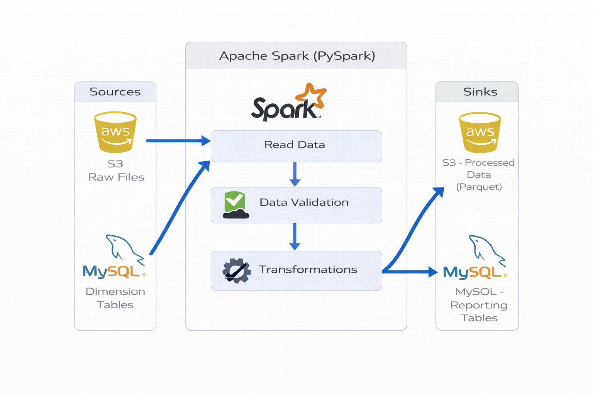

# Retail-Sales-Data-ETL-Pipeline
**Apache Spark | Apache Airflow | AWS S3 | MySQL | Python**

---

## Overview

This project implements a **production-style batch ETL pipeline** for processing retail sales data using **Apache Spark**, orchestrated with **Apache Airflow**.  
The pipeline ingests raw sales files from **Amazon S3**, validates and transforms the data, persists curated datasets, and ensures **idempotent processing** using a MySQL-backed staging layer.

The implementation closely mirrors **real-world data engineering systems**, focusing on reliability, observability, and data quality rather than notebook-style experimentation.

---

## Technology Stack

| Layer | Technology |
|------|-----------|
| Orchestration | Apache Airflow |
| Processing | Apache Spark (Local Mode) |
| Storage | AWS S3 |
| Metadata & Tracking | MySQL |
| Language | Python |
| Environment | Windows + WSL (Local setup) |

---

## High-Level Architecture



1. **Ingestion**
   - Raw CSV files are read from an S3 source directory using `s3a://`.
   - File discovery is handled dynamically.

2. **Validation & Data Quality**
   - Schema enforcement
   - Mandatory field validation
   - Business rule checks (e.g., positive prices)
   - Duplicate handling

3. **Transformation**
   - Data normalization
   - Aggregations and joins
   - Partitioned Parquet output for analytics marts

4. **Persistence**
   - Cleaned datasets written to S3 (data mart layer)
   - Invalid records written to a separate S3 error path

5. **Idempotency**
   - MySQL staging table tracks file processing status
   - Prevents reprocessing of previously ingested files

6. **File Lifecycle Management**
   - Successfully processed files → `processed/`
   - Failed files → `error/`

7. **Orchestration**
   - Airflow DAG controls execution, retries, and failure handling
   - Spark jobs executed via `spark-submit`

---

## Star Schema Design


---

This project uses a **Star Schema–style data model** as the **final curated layer** produced by the ETL pipeline.  
The schema is designed to support **clean data integration, consistency, and downstream consumption**.

---

### Fact Table

**SALES**  
The central fact table captures transactional sales data and contains measurable metrics:

- `price`
- `quantity`
- `total_cost`
- `sales_date`

Foreign keys link the fact table to the dimensions:

- `customer_id`
- `store_id`
- `sales_person_id`
- `product_id`

---

### Dimension Tables

The following dimension tables provide descriptive context for analysis:

- **CUSTOMER**
  - Customer demographics and location details
- **STORE**
  - Store address, pincode, and opening date
- **SALES_TEAM**
  - Salesperson attributes and hierarchy (manager relationship)
- **PRODUCT**
  - Product name and pricing attributes

---

### Why Star Schema?

- Provides a **clear separation between transactional facts and reference data**
- Schema enforcement prevents silent data corruption
- Centralized dimensions reduce duplication across datasets
- Simplifies Spark SQL joins and aggregations
- Aligns with industry-standard **data warehouse modeling**
- Scales well for future BI and reporting use cases

This schema design reflects **real-world data warehouse practices**, making it suitable for production-style ETL pipelines.

---

## Folder Structure
```
Sales-Data-ETL/
├── airflow/
│   └── sales_etl_dag.py
│
├── docs/
│   ├── Architecture.png
│   └── database_schema.png
│
├── resources/
│   ├── dev/
│   │   ├── config.yaml
│   │   └── requirements.txt
│   │
│   └── sql_scripts/
│       └── create_table_scripts.sql
│
├── scripts/
│   ├── generate_data/
│   │   ├── generate_csv_data.py
│   │   ├── generate_customer_table_data.py
│   │   ├── generate_product_table_data.py
│   │   ├── upload_file_to_s3.py
│   │   └── write_generated_data_to_database.py
│   │
│   └── main/
│       ├── move/
│       │   └── move_files.py
│       │
│       ├── read/
│       │   ├── aws_read.py
│       │   └── database_read.py
│       │
│       ├── transformations/
│       │   └── jobs/
│       │       ├── customer_reporting_transformations.py
│       │       ├── data_validation.py
│       │       ├── dimension_tables_join.py
│       │       ├── main.py
│       │       └── salesperson_reporting_transformations.py
│       │
│       ├── utility/
│       │   ├── config_loader.py
│       │   ├── logging_config.py
│       │   ├── my_sql_session.py
│       │   └── spark_session.py
│       │
│       └── write/
│           ├── database_write.py
│           └── dataframe_format_writer.py
│
└── README.md
```
---

## How to Run the Project

### 1. Clone the Repository
```
git clone https://github.com/Aditya-Shinde-21/Retail-Sales-Data-ETL-Pipeline.git
cd Retail-Sales-Data-ETL-Pipeline
```

### 2. Create virtual environment
```
python -m venv .venv
source .venv/bin/activate      # Linux / macOS
.venv\Scripts\activate         # Windows
```

### 3. Install dependencies
```
pip install -r requirements.txt
```
Required Windows Subsystem for Linux (WSL) for Airflow if using Windows

### 4. Generate data and upload it to s3
Generate data from  and 
Upload data to s3 from 

### 5. Airflow setup
#### Open WSL terminal and activate airflow virtual environment. Copy DAG to airflow/dags/
```
source ~/airflow_venv/bin/activate
mkdir -p ~/airflow/dags
cp /mnt/d/Retail-Sales-Data-ETL-Pipeline/airflow/sales_etl_dag.py \
~/airflow/dags/
```

### 6. Launch Airflow from wsl
```
airflow standalone
```

### 7. Add AWS and MySQL connection to airflow

- AWS and MySQL credentials are managed using **Airflow Connections**
- No credentials are hardcoded in Spark or application code
- Environment variables are injected automatically by Airflow at runtime

---

## Data Validation Examples

- Non-null primary key validation  
- Positive price validation  
- Duplicate removal based on business keys  
- Schema conformity checks  

Invalid records are written to a **separate S3 location** for audit, troubleshooting, and reprocessing.

---

## Limitations

- Spark runs in **local mode** (no distributed cluster).
- IAM roles are not used (AWS S3 credentials via Airflow Connections)

---

## Future Enhancements

- Implement **SCD Type 2** for product pricing
- Integrate **Delta Lake** or **Apache Iceberg**
- Deploy Spark on cloud platforms (EMR / Databricks)

---

## Why This Project Matters

This is **not a toy ETL pipeline**.

It demonstrates:

- Real-world ETL pipeline
- Supports historical backfill and file status tracking using staging table
- Invalid data isolated for safe reprocessing
- Production-style logging for Debugging and observability
- Practical integration of **Apache Spark** and **Apache Airflow**

---

## Author

**Aditya Shinde**  
Data Engineer  
Passionate about building scalable data pipelines

---
Last updated - january 2026
